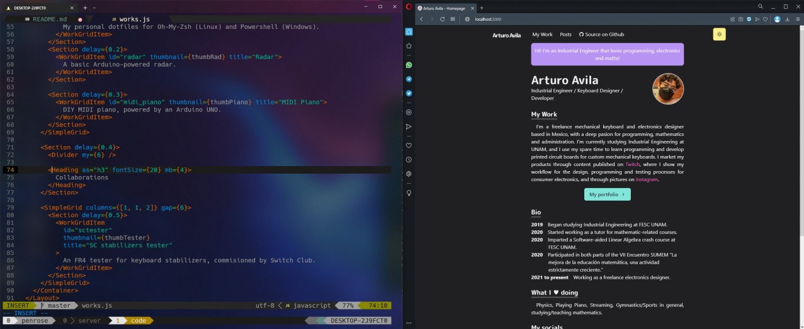
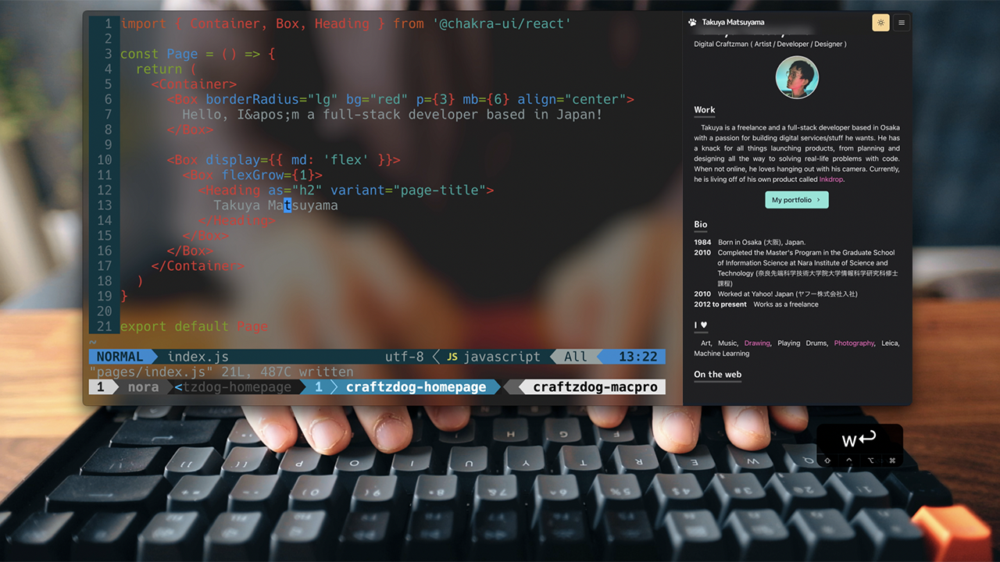

# Arturo's Homepage

[](https://adph.vercel.app)

## Tutorial

Watch how Takuya built his version of the website on YouTube:

[](https://www.youtube.com/watch?v=bSMZgXzC9AA)

## Stack

- [Next.js](https://nextjs.org/) - A React framework with hybrid static & server rendering, and route pre-fetching, etc.
- [Chakra UI](https://chakra-ui.com/) - A simple, modular and accessible component library for React
- [Three.js](https://threejs.org/) - 3D library for JavaScript
- [Framer Motion](https://www.framer.com/motion/) - An animation library for React

## Project structure

```
$PROJECT_ROOT
│   # Page files
├── pages
│   # React component files
├── components
│   # Non-react modules
├── lib
│   # Static files for images and 3d model file
└── public
```

## License

MIT License.

You can create your own homepage for free by forking Takuya's original project under the following conditions:

- Add a link to [his homepage](https://www.craftz.dog/)
- Do not use the 3d voxel dog

Check out [LICENSE](./LICENSE) for more detail.

---

Looking for a Markdown note-taking app? Check out Takuya's app called Inkdrop:

[](https://www.inkdrop.app/)
